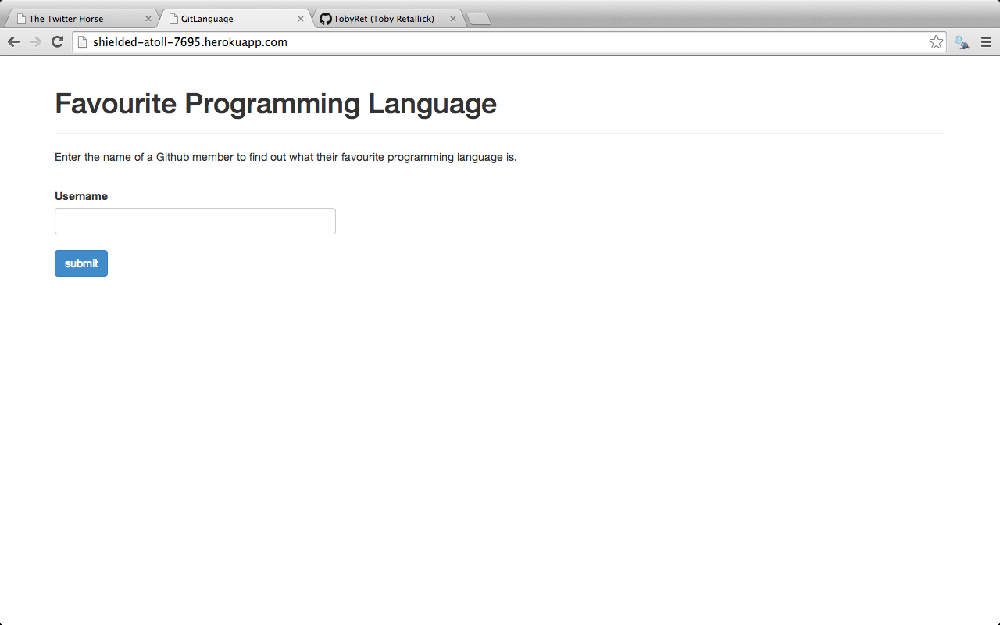

Favourite Programming Language
------------------------------

This app uses the Github API to determine the likely 'favourite' programming language for a particualr Github user.

The app works by fetching a user's repositories and measuring the frequency of each programming language used, returning the one with the highest frequency.

### Access the app
This app is live on Heroku - http://shielded-atoll-7695.herokuapp.com/

### To do
These are some further improvements that need to be made:

1. Authenticating Github api calls or stubbing requests to API. Currently only 60 calls an hour allowed.
2. Error handling for when a user enters an invalid Github username.

### Screengrab

